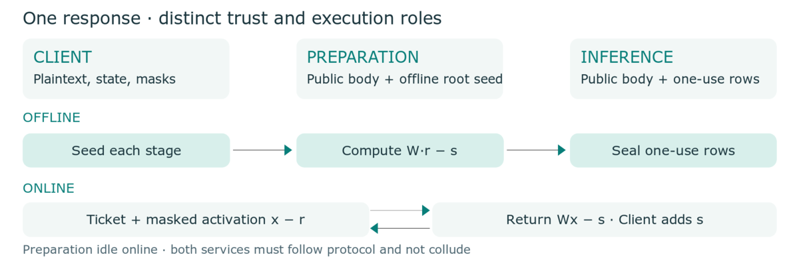
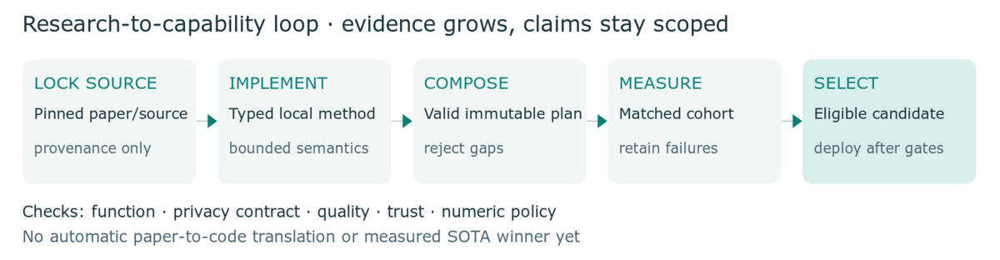

## Use remote compute. Keep sensitive context local.

AI applications increasingly work with private conversations, documents, and
business workflows. Conventional hosted inference exposes that context to the
serving operator. Running everything locally avoids this disclosure but requires
enough local memory and compute for the chosen model.

**Private inference offers another route:** use outside compute while protecting
the inputs and intermediate calculations from individual providers. The hard
part is making that protection useful at ordinary network speeds and acceptable
cost. PLLM turns this into a measurable engineering and research problem.

## A working system and a place to improve it

PLLM provides a Python SDK, a local API gateway, a native execution engine, and
composable experiments. Applications use the trusted client or gateway; researchers
change the protocol, numerical representation, placement, or delivery method.
A compiler checks that the selected pieces form an executable plan.

The current public-weight prepared path keeps prompts, nonlinear calculations,
model state, and output decoding at the client. Preparation creates fresh masking
material before a response. Inference then performs matrix calculations on masked
inputs; only the client removes the output masks. Preparation stays idle online.

The two services must follow the protocol and **not collude**; Preparation must
erase its masks. Self-hosted Preparation keeps that trust inside the client
boundary. Public weights are not protected, and timing and traffic patterns remain
visible. Two processes owned by one operator do not establish this trust model.

\newpage

## Research with a clear scorecard

Three constraints dominate practical private inference:

- **Network:** reduce bytes and dependent exchanges on both client and provider
  links. Fewer client bytes can simply move traffic elsewhere.
- **Compute:** beat a matched two-worker additive-sharing control, which performs
  each outsourced matrix product twice. Moving one product into offline
  Preparation changes its timing, not its total cost.
- **Memory and fidelity:** fit real checkpoints on available machines while
  preserving the declared model behavior. Smaller memory or traffic bills must
  be weighed against CPU, disk, and output quality.

## A repeatable loop for people and AI agents

An agent can propose a method, implement it, construct an experiment, run a
matched control, and inspect the resulting evidence. PLLM supplies the reusable
execution and measurement machinery: pinned sources, immutable configurations,
bounded resource checks, one-use material, and reports tied to exact workloads.
Failed ideas remain useful evidence for the next experiment.

This supports autonomous experimentation. It does not measure an autonomous
discovery rate or replace specialist security review. A tenfold improvement is
a research target with a named baseline and cost scope, not a property of PLLM.

## What the research has shown so far

**Network scheduling helps.** In one matched Qwen2.5-0.5B cohort with shared
100/40 Mbps access and 40 ms added round-trip delay, overlapping the two-worker
requests improved decode throughput **1.94×**, with unchanged application bytes.
Prepared delivery and issuance overlap improved request throughput **17.3%**.

**Larger models expose memory ownership.** A Qwen3-4B response used **421 MB**
client-process peak RSS with paged weights. A separate Preparation-only probe
reduced peak RSS **6.24×**, from 4.61 GB to 739 MB, with identical corrections,
12.4% more loading-plus-issuance CPU, and 3.63 GB of private snapshot files.

**The compute challenge is still open.** One separate cold Qwen2.5 response used
34.66 aggregate CPU seconds for Preparation plus Inference and the client,
versus 28.65 for the two-worker control. Lower online work alone is not a
whole-response compute win.

These are scoped local measurements, not independent-provider deployments or
representative quality results. The 4B run has no matched resident-client control;
10× whole-client memory and 10× network reductions remain unestablished.

**Next:** combine promising methods, test complete responses, and retain only
improvements that survive the full scorecard.
[Technical paper](https://pllm.run/research/paper/),
[SDK and experiments](https://pllm.run/sdk/), and
[reports and reproduction commands](https://github.com/blairhudson/pllm/tree/main/docs/evidence).
